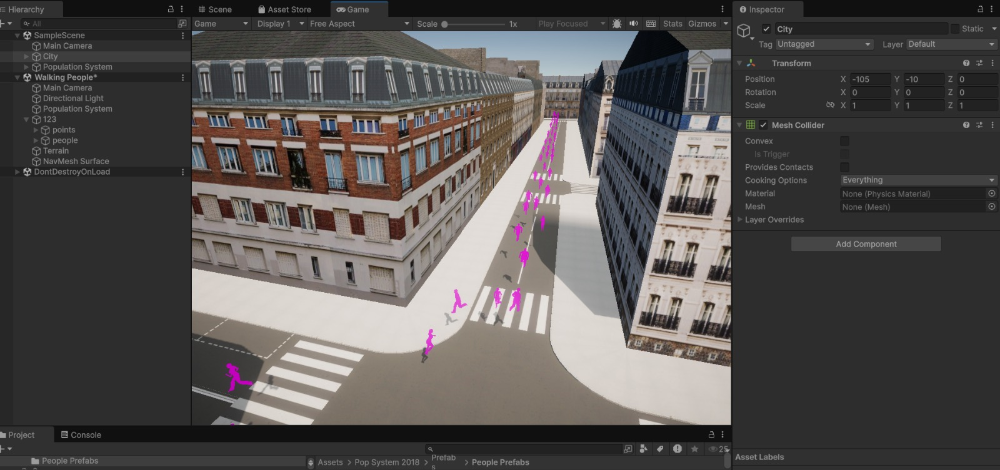
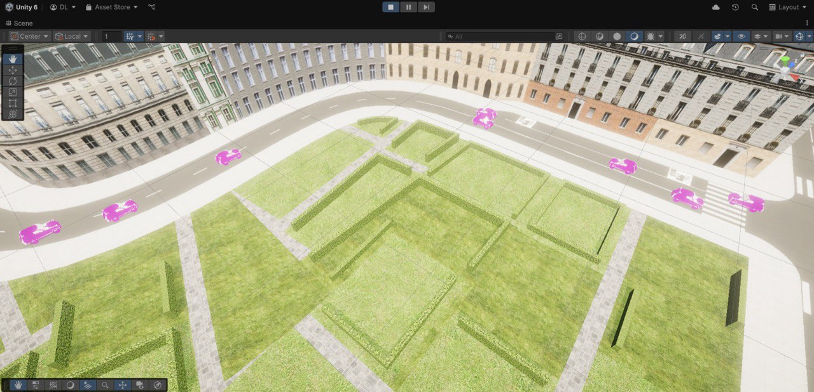
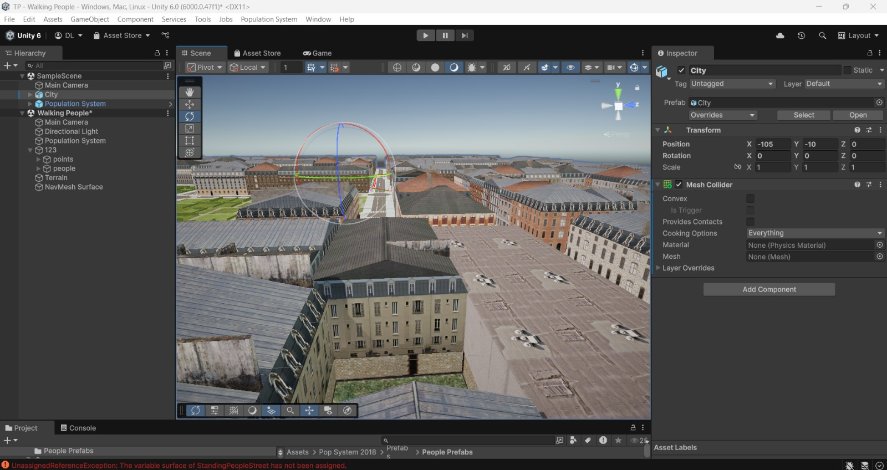
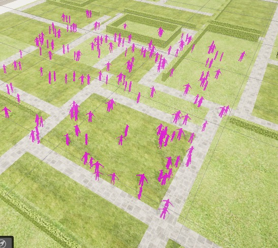
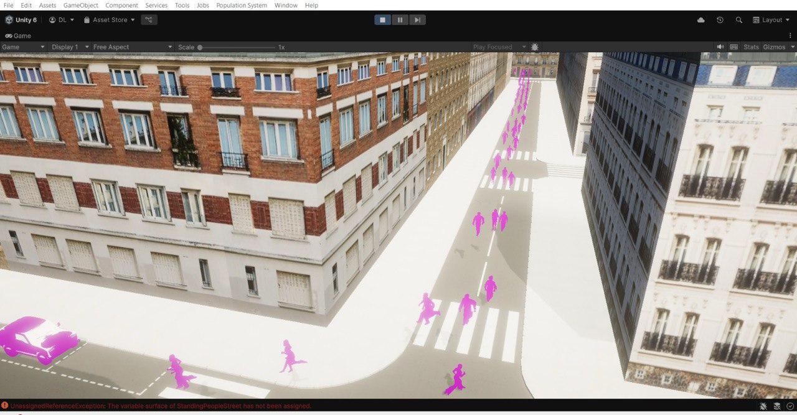

# 🏙️ Simulation de Piétons dans une Ville Virtuelle

Ce projet est une simulation de piétons dans une ville virtuelle. Il vise à modéliser et observer le comportement piétonnier dans un environnement urbain dynamique, en prenant en compte des facteurs comme les infrastructures, les flux de population, les obstacles et les règles de circulation piétonne.



---

## 🎯 Objectifs du Projet

- Simuler le déplacement des piétons dans une ville virtuelle.
- Étudier les comportements émergents dans différents scénarios urbains.
- Reproduire le mouvement naturel des piétons (marche, course, arrêt) dans un environnement
urbain virtuel.
- Mettre en place des animations réalistes correspondant à différents états (déplacement, arrêt,
changement de direction, etc.).

---

## 🚀 Fonctionnalités

- 🔁 **Génération automatique de piétons** selon des paramètres personnalisés
- 🧠 **Modélisation des comportements** (évitement d'obstacles, suivi de trajectoires, regroupements, comportement collectif)
- 🌆 **Modélisation d'une ville** avec rues, carrefours, bâtiments et zones piétonnes
- 📈 **Visualisation** en temps réel de la simulation
- 💬 **Logs & Statistiques** sur les déplacements, collisions, regroupements



---

## 🧰 Technologies Utilisées

| Technologie     | Usage                             |
|----------------|------------------------------------|
| Unity  | Moteur de rendu et simulation |
| Blender  |  Modélisation 3D et les animations |
| Visual Studio  |  Environnement de développement des scripts en C# |
| Gimp  |  Pour la création et l'édition de textures |
| NavMesh  |  Pour la navigation et le pathfinding |
| DOTween  |  Pour des animations procédurales fluides |
| TextMesh Pro  |  Pour une interface utilisateur de qualité |
| Git / GitHub    | Collaboration et gestion de versions |

---

## 🏁 Installation

1. Clonez ce dépôt :
   ```bash
   git clone https://github.com/DavidLUTALA/Simulation_Pietons_Ville_Virtuelle.git
   cd Simulation_Pietons_Ville_Virtuelle


---

## 🧪 Exemples de Scénarios Simulés

- 🏃 Course à pied amicale dans les rues urbaines
- 🧍 Marché en plein air un samedi matin avec forte densité piétonne
- 🌳 Rencontre sociale dans un espace vert (type parc ou square)

---

## 🧑‍🤝‍🧑 Équipe de Développement

Ce projet a été réalisé dans le cadre d’un travail de groupe. Chaque membre a contribué activement à la conception, au développement et à la documentation.

| **Nom complet**              | **Rôle(s) principaux**                                      |
|------------------|-----------------------------------------------------|
| TAKOUCHOUANG Fraisse      | Analyste et Responsable qualité               |
| EBWALA Priscille  | Développeuse           |
| LUTALA David    | Leader         |

> *Nous avons utilisé un système de branches et des pull requests pour permettre une collaboration fluide et une revue de code rigoureuse.*

---

## ✅ Répartition des Tâches

| Membre           | Modules développés                    | Revue de code | Tests | Docs |
|------------------|----------------------------------------|---------------|-------|------|
| TAKOUCHOUANG Fraisse      | Scénarios à simuler, Documentations( Rapport, Slides Présentation ), Validation Test           | 🟡            | ✅    | ✅   |
| EBWALA Priscille  |  Conception du système, Modélisation 3D des piétons et environnement, Intégration des modèles  | ✅            | ✅    | 🟡   |
| LUTALA David    | Comptes rendus, Comportements de déplacement des piétons, Scripts de systèmes de navigation.             | ✅            | 🟡    | ✅   |

---

## 📸 Captures d'écran








---

## 🙌 Remerciements

- À notre encadrant **Dr.Thong DANG** pour l’accompagnement méthodologique
- Aux plateformes open source qui ont inspiré certaines mécaniques
- Aux testeurs bénévoles (Nos camarades de cours) pour leurs retours très utiles
